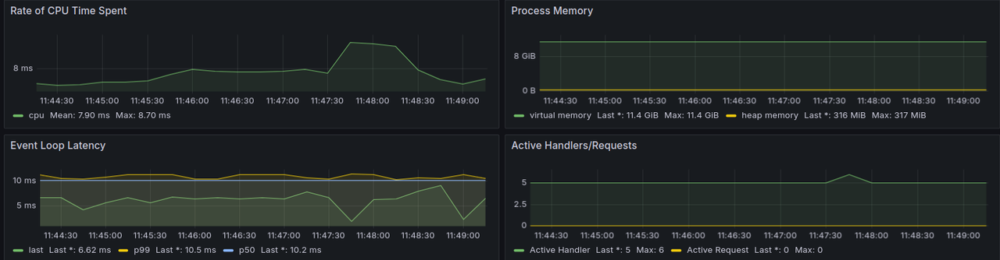
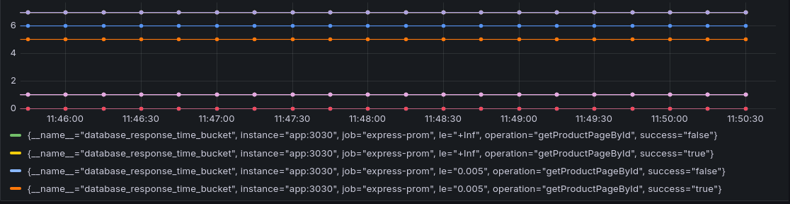

# E-commerce-Backend-G2
This project is an E-commerce application developed as part of the MVP phase requirements for the TAP program.
It provides a backend API that supports user authentication, product management, and simulated payment processing. 
The application is designed with scalability, modularity, and security in mind, using JWT for authentication, PostgreSQL for the database, and Redis for caching.

### Technologies used:
```
 • Node.js
 • Typescript
 • Express
 • JWT
 • PostgreSQL
 • Firebase
 • Sequelize
 • Jest
 • Apache JMeter
 • Redis
 • Prometheus
 • Grafana
 • Docker
 • Swagger 
```

### Table of Contents

    1. Project Structure
	2. Features
	3. Setup and Installation
	4. Environment Variables
	5. Database Schema
	6. Simulated Payments
	7. Error Handling
	8. Roles and Permissions
	9. Testing
	10. Logging
	11. Security Measures
	12. Dockerization
	13. Caching
	14. Load Testing
	15. Monitoring
	16. Documentation


### Project Structure

The project follows a modular structure.

```plaintext
/src
    /config
    /controllers
    /database
    /middleware
    /routes
    /utils
    redis.ts
    server.ts
    token.ts
    /test
    package.json             
```

### Features

	• User Authentication: JWT-based authentication with role-based access control (Admin and User).
	• Product Management: CRUD operations for products, along with features like discounts, ratings, new arrivals, and handpicked collections.
	• Simulated Payments: A dummy payment system for testing purposes.
    • Image Upload: A process to upload images using Firebase.
	• Error Handling: Robust error handling with proper status codes and messages.
	• Roles and Permissions: Admin and User roles with different access levels and permissions within the app.
	• Security: HTTPS, input sanitization, and validation to prevent common vulnerabilities and errors.
	• Testing: Unit and integration tests with Jest and Supertest.
    • Load Testing: Implementation of Load Testing with Apache JMeter.
	• Caching: Use of Redis for caching frequently accessed data.
	• Monitoring: Integrated monitoring using tools like Grafana and Prometheus.
	• Deployment: Dockerized application with deployment scripts for easy deployment to different environments.
	• Documentation: In-depth documentation of API endpoints with Swagger.

### Setup the environment variables:

Create a .env file in the root directory and configure the following:

````
PORT=5000
DATABASE_URL=www.PostgresURL.com
DATABASE_USER=your_database_username
DATABASE_PASSWORD=your_database_password
JWT_SECRET=123456789
REDIS_URL=www.RedisURL.com
````
### Running the application: 
To clone the repository and navigate to the project directory, run the following commands:

```bash
git clone https://github.com/E-commerce-Backend-G2.git
cd E-commerce-Backend-G2
npm install
npm start
````

### Simulated Payments

The application includes a simulatePaymentProcessing controller that simulates success or failure for payment processing. The success rate can be configured for testing purposes. Transactions are saved in the database for historical data analysis.

### Error Handling

Error handling has been implemented across all controllers and routes, with meaningful status codes and error messages. Errors are logged for debugging purposes.

### Roles and Permissions

	Admin:

	• Full access to CRUD product management and user management.
	• Access to statistical and data analysis features.
	• View statistics such as most bought products, products per country, etc.

    User:

	• Access to view and purchase products.
	• Cannot access statistical features.

### Testing

Unit tests are implemented for controllers, models, and middleware:

	• P0 Tests: Critical tests for essential functionalities (authentication, CRUD operations).
	• P1 Tests: Tests for edge cases, error handling, and optional features.

### Test Strategy:

	• P0 Tests run per commit.
	• P1 Tests run for pull requests on the master branch before deployment.

Run Jest tests using:

```Bash
npm run test
```
### Logging

The application integrates a logger to track errors, user activities, and system behavior in a structured format.

### Security Measures

	• HTTPS: Ensure the application runs over HTTPS.
	• Input Sanitization and Validation: All user inputs are sanitized and validated to prevent XSS, SQL injection, and other vulnerabilities.
    • JWT Authentication: User sessions are managed using JWT tokens.
    • Password Encryption: User passwords are encrypted using bcrypt to prevent password theft.
    

### Dockerization

The application is dockerized with the following files:

	• Dockerfile: Defines the Docker image configurations.
	• docker-compose.yml: Configures multi-container Docker applications.

Build and deploy the Docker image:

```bash
docker-compose up --build
```

### Caching

Redis is used for caching frequently accessed data to improve performance. Cache expiration policies are configured based on usage patterns.

### Load Testing

Use tools like Apache JMeter to perform load testing on the APIs. 
The results used to analyze the app to optimize performance and scalability.

### Monitoring

Monitoring is implemented using tools like Grafana and Prometheus to track key metrics:

	• User activities: User product searches.
	• API performance: Query execution times, database load, etc.
	• Critical endpoints: Product listings.

### Documentation

API documentation is generated using Swagger.

```bash
http://localhost:5000/SWAGGER-API
```

### Contributing

Please contact the developers before contributing to this project.

### License: 
This project is licensed under the MIT License.

### Developers:

    Mennatallah Khayat
    Amr Abu kharmeh
    Feras Abushahla
    Ramzi Osta

## Test the app

Use tools like Postman to test the suggested routes.
```text
| Endpoint                           Method       | Description                                                                           
|----------------------------------|--------------|----------------------------------------------------------------------------------------
User Routes
| /users/register                  | POST         | Adds a new user to the database.                                                  
| /users/login                     | POST         | Authenticates a user, and generates a token.                                       
| /users/update                    | POST         | Updates a user.                                        
| /products/itemPage               | GET          | Retrieves item page details by ID, with caching..                     
| /products/itemByCategory         | GET          | Retrieves items by category ID.                        
| /products/itemByBrand            | GET          | Retrieves items by brand ID.                          
| /products/handPickedCollection   | GET          | Retrieves hand-picked collection items.                 
| /products/productSearch          | GET          | Searches for items based on search value, with validation.                            
| /products/newArrivals            | GET          | Retrieves new arrival items.                           
| /products/itemCardOne            | GET          | Retrieves item card one data, with caching.                                            
| /products/itemCardTwo            | GET          | Retrieves item card two data, with caching.                                            
| /products/itemCardThree          | GET          | Retrieves item card three data, with caching.      

Admin Routes  
| /users/registerAdmin             | POST         | Registers an admin user, with validation.                                             
| /users/adminLogin                | POST         | Authenticates an admin user, with validation.                                         
                                 
| /products/addItemToCart          | POST         | Adds an item to the cart, requiring user authentication and product ID validation.     
| /products/reduceItemFromCart     | DELETE       | Reduces the quantity of an item in the cart, requiring user authentication and product ID validation.
| /products/removeItemFromCart     | DELETE       | Removes an item from the cart, requiring user authentication and product ID validation. 
| /products/toggleItemInWishList   | POST         | Toggles an item in the wishlist, requiring user authentication and product ID validation.
| /products/upsertUserReview       | POST         | Upserts (creates or updates) a user review, requiring user authentication and review validation.
| /products/createNewProduct       | POST         | Creates a new product, requiring admin authentication and product data validation.       
| /products/deleteProduct          | DELETE       | Deletes a product, requiring admin authentication and product ID validation.           
| /products/updateProduct          | PUT          | Updates a product, requiring admin authentication and product update data validation.    
| /products/uploadProductImages    | POST         | Uploads product images, requiring admin authentication and middleware for handling uploads.

Checkout experience: 

| /cart/newAddress	           | POST	  | Creates a new address for the user, requiring user authentication and address validation.
| /cart/allAddresses	           | GET          | Retrieves all user's addresses, requiring user authentication.
| /cart/shoppingCart	           | GET	  | Retrieves the user's shopping cart, requiring user authentication.
| /cart/addTranaction	           | POST	  | Creates a new transaction (potentially for payment), requiring user authentication and transaction validation.
| /cart/checkout	           | POST	  | Triggers the checkout process, requiring user authentication and checkout validation.

```

The following activities can be done:
```text
1- Register a new user, login, update and .
2- Register an admin.
3- Browse the products
4- Experience the shopping cart
5- Check out the products
6- Add new products to the shopping cart
7- Remove products from the shopping cart
8- View all user's addresses
9- Create, update and delete products
10- View all orders
11- View all Transactions.
12- Interact with the user's wishlist and more!

```
## Project Screenshots :

## redis:
```text
Redis Cache and Database Data Retrieval

In our backend application, we leverage Redis to optimize the performance of our API by caching responses to reduce load times and minimize database queries. The following screenshots illustrate how this caching mechanism works and how data is retrieved, either from Redis or directly from the database.
```
Screenshot 1: Database Data Retrieval


In this scenario, the request for the product data does not find any existing cached data in Redis. Consequently, the server fetches the data directly from the database. The following key points are visible in the screenshot:

	•	Response Headers: The X-Data-Source header in the HTTP response indicates that the data was retrieved from the “database”.
	•	Logs: The logs in the terminal display database 🥳, confirming that the data was indeed fetched from the database.
	•	Performance: The API request took around 735.608 ms, which is typical for a database retrieval without any caching.
Screenshot 2: Cached Data Retrieval


In this scenario, the request for the product data is found in Redis cache, and therefore, the server retrieves the data directly from Redis without querying the database. The following key points are visible in the screenshot:

	•	Response Headers: The X-Data-Source header in the HTTP response now indicates that the data was retrieved from the “cache”.
	•	Logs: The logs in the terminal display cached 😁, confirming that the data was retrieved from Redis cache.
	•	Performance: The API request took significantly less time, approximately 7.655 ms, showcasing the efficiency of retrieving data from the cache.

How It Works

	1.	Cache Check: When a request is received, the middleware first checks Redis to see if the response for the requested URL is already cached.
	•	If cached data is found, it is returned immediately, and the response header is set to indicate that the data was retrieved from the cache.
	•	If no cached data is found, the server fetches the data from the database.
	2.	Data Caching: After retrieving data from the database, it is stored in Redis for future requests. The data is cached with an expiration time, ensuring that it stays fresh and up-to-date.

By using Redis caching, our application significantly reduces the time it takes to serve repeated requests, enhancing the overall user experience and reducing the load on our database.

## Swagger:

API Endpoints
```text
The API exposes the following endpoints:

/products/itemCardTwo: Retrieves detailed information about a specific product identified by the itemCardTwo parameter.

GET: Used to retrieve data from the API.
Request Parameters
itemCardTwo: The unique identifier of the product to retrieve.
```
##### Response Structure:
The API response is a JSON object containing the following fields:

    • title: The product title.
    • label: The product label or description.
    • discount: The percentage discount applied to the product.
    • rating: The average product rating.
    • totalRatings: The total number of ratings for the product.
    • unitsSold: The number of units sold for the product.
    • brand: The product brand information, including the brand title and category details.

##### Example Request
GET https://e-commerce-backend-g2.onrender.com/docs/#/Products/get_products

Example Response JSON
```text
{
  "title": "Porch Shine Powder Canister",
  "label": "Lantick",
  "discount": 18,
  "rating": 5,
  "totalRatings": 1,
  "unitsSold": 3,
  "brand": {
    "brandTitle": "Veluwt Touch",
    "categories": [
      {
        "categoryId": 1,
        "categoryName": "Beasty"
      }
    ]
  }
}
```


## Load testing:
```text
Test Plan Overview:
The test plan consists of multiple HTTP requests to simulate user interactions with the E-commerce API. The requests include fetching the home page, searching for products, and retrieving product details by brand and category.

Test Plan Structure

The test plan is organized as follows:
1- HTTP Request Defaults: Configured to set common properties for all HTTP requests.
2- Get home page: Simulates a request to load the home page.
3- Search for product or brand: Simulates a search request by product or brand.
4- Get Products by Brand ID: Fetches products associated with a specific brand.
5- Get Products by Category ID: Fetches products associated with a specific category.
```
Test Results:
1. View Results Tree
The View Results Tree listener captures the details of each request, including the response data. Below is a screenshot of the View Results Tree showing the response for the "Get home page" request:


The response includes product details such as categoryTitle, brandTitle, price, rating, unitsSold, and other relevant fields.

2. Summary Report


The Summary Report shows that all requests were successfully executed with no errors. The average response time and throughput for each request are also provided.


## Monitoring
Monitoring is provided using prometheus and visualized using grafana and can only be used in docker container

Routes: 

Deploying the docker container will create four servers :

    localhost:3000 for the backend app
    localhost:3030 for exporting the metrics (localhost:3030/metrics)
    localhost:9090 for the prometheus server
    localhost:3002 for the grafana server

Usage:

After deploying grafana can be accessed using (localhost:3002) the default user name and password are :

    username : admin
    password : admin
After accessing grafana you need to add the data source as (http://localhost:9090) depending on the deploy and then u can add you dashboard

### Examples:

##### General information about monitoring example


##### Database monitoring examples:

Database operation example


Database general example


Database requsets with results example


##### RESTfull api monitoring example
#####Request api request count example

##### Request api response latency example


```text


```
### To better enjoy the app please see E-commerce-Frontend-G2 repository.


#### Built with 🇵🇸💪🏻🧠 ©™